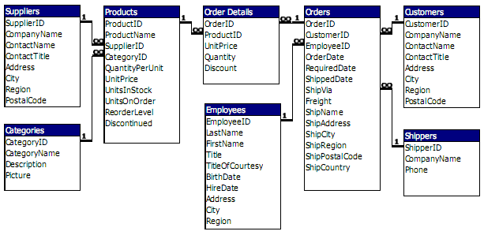
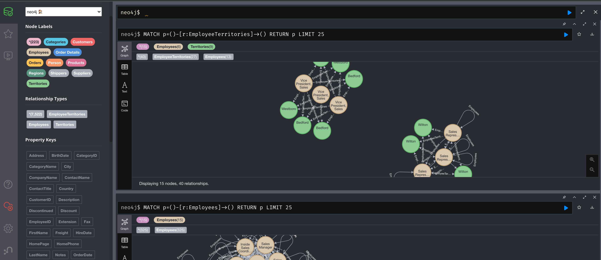

# cyfred-test

Create Graph DB from existing RDBMS

> Source

> Result

### Approach

Extract RDBMS schema definition, sort and classify tables based on their dependencies.
Generate Cypher commands: Node or Relation for each table based on the classification.

### Architecture

#### sql
SQL parser classes

#### RDBMS
DB drivers

#### graph
Neo4j driver and Cypher generator

### Docker

use `IP=YOUR_HOST_IP docker-compose up -d`

### TODO

 [ ] Finish tests
 [ ] Use typescript
 [ ] Improve documentation
